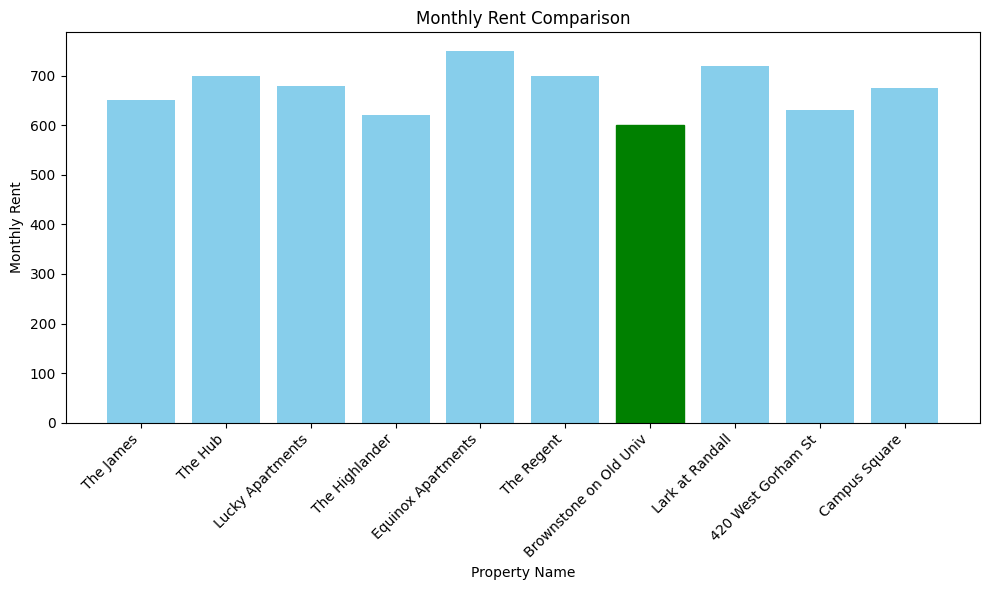

# 🏡 Tailored Housing Recommendation using Mixed Integer            Programming (MIP)

This project demonstrates how Mixed Integer Programming (MIP) can be used to recommend optimal student housing options based on constraints like rent, proximity to campus, and availability of amenities. It was developed as part of a data-driven decision-making exercise at the University of Wisconsin–Madison.

## 📂 Project Structure

| File Name                                                                    | Description                                |                                             
|------------------------------------------------------------------------------|--------------------------------------------|
| [Application_of_MIP_Code.ipynb](./Application_of_MIP_Code%20(1)%20(1).ipynb) | Jupyter notebook implementing the MIP model|
| [Presentation.pdf](./Dark%20Blue%20Modern%20Real%20Estate%20Presentation%20(1).pdf) | Summary slide deck of the project  |

## 📈 Problem Overview

The objective of this project is to **recommend the most suitable housing option** for graduate students by optimizing for:
- **Minimum rent**
- **Shortest distance to campus**
- **Student-defined constraints** such as budget, proximity, or specific apartment features

The core logic is implemented using Python's `PuLP` library for formulating and solving the MIP model.

## ✅ Methodology

- Formulated as a **0-1 Integer Linear Programming** problem
- Decision variable: `x[i] = 1` if property `i` is selected, else `0`
- Objective: Minimize a weighted combination of rent and distance
- Constraints include:
  - Exactly one apartment must be chosen
  - Budget limitations
  - Proximity thresholds (e.g., within 1 mile of campus)

## 📊 Results

Based on the available data, **Brownstone on Old Univ** emerged as the optimal property:
- 📍 0.3 miles from campus
- 💰 $600 rent per month

## 🧩 Challenges

- Limited data availability (sampled dataset for demonstration)
- Binary constraint on proximity (near vs. not near) is simplistic

## 🚀 Future Enhancements

- Incorporate **real-time apartment listings** via APIs
- Use **fuzzy logic or soft constraints** to allow more flexible preferences
- Build a **web-based UI** to make the model accessible to students

## 💻 Tech Stack

- Python
- Jupyter Notebook
- `PuLP` optimization library
- `pandas`, `matplotlib` for data processing and visualization

